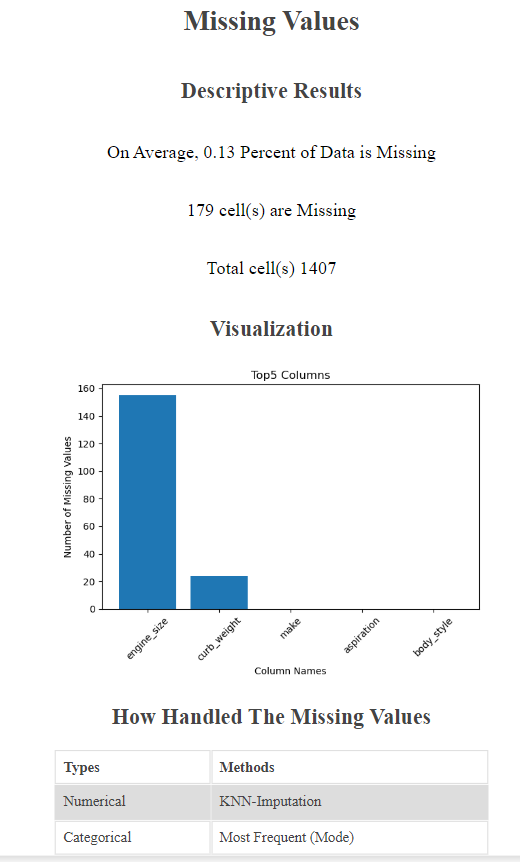
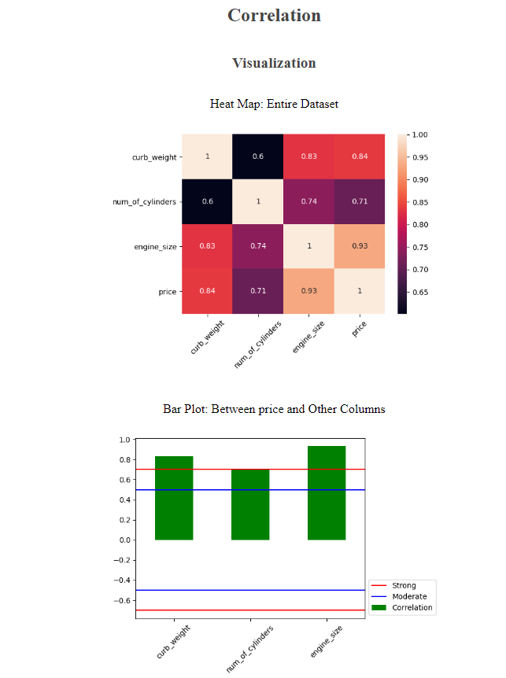
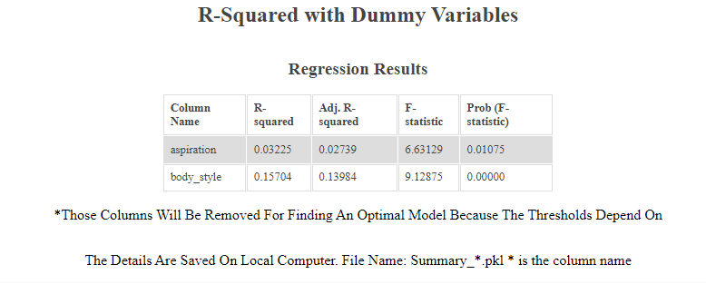
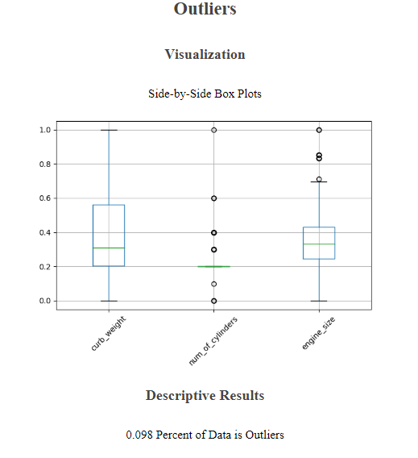
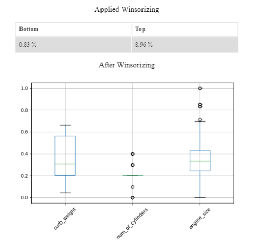
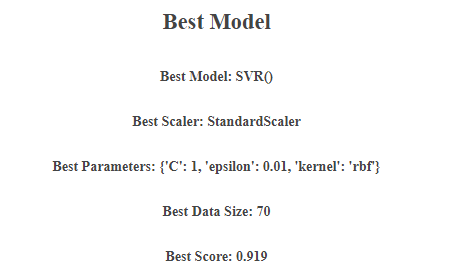
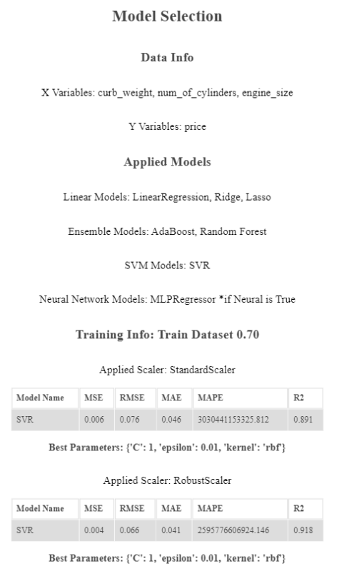

# Auto Data Analysis Regression

## Motivation
One of the daily challenges for data scientists is selecting an optimal model. To select the optimal model, we need to work on data cleaning, such as handling missing values and outliers. Even if we carefully clean up the data, there is no promise of meeting the optimal model. On top of that, all datasets are unique and require different approaches to discover an optimal model. Several data scientists prefer to use Random Forest as their first choice because the model works well in general. However, the model is expensive, and there might be a better model if we tune it up well. The auto data analysis for regression suggests an optimal model, hyper-parameters, and proportion of train datasets.

## 1. Requirnents
- python ==> 3.9
- py7zr
- Chrome Broweser   

### Install:
```shell
pip install -r requirements.txt 
```

## 2. Execution
### Analysis Regression
```shell
python main.py -I demo.csv -T AveragePrice -R 0 Date -D type region
```

For the more details of parameters, please run:
```shell
python main.py --help
```

### Re-Open Browser
Example:
```shell
python decompress.py -F demo.7z
```

For the more details of parameters, please run:
```shell
python decompress.py --help
```

## 3. Explain 
### Missing Values

Auto Analysis detects missing values as its first step, and it visualizes them with a bar plot.
If any missing values are detected, the model automatically applies KNN-imputation for numerical variables and mode for categorical variables.

### Descriptive Statistics

Auto Analysis displays the descriptive statistics and the target behavior with a box plot quickly.

### Correlation

Auto Analysis displays the entire correlation with a heatmap and then goes to a one-step deeper analysis. The bar plot shows the correlations between the target and other numerical variables. The model sets up a strong threshold with 0.7 and -0.7 and a moderate threshold with 0.5 and -0.5. The table shows the correlation values.

### R-Squared with Dummy Variables

This is an optional step. The model can discover the relationships between the target and categorical variables if the model receives any value.
However, the thresholds depend on the situations, and the model will drop off any categorical columns when it finds an optimal model.

### Outliers

Using the side-by-side plots, the model visualizes outliers effectively and calculates the percentage of outliers.


If the percentage is over 5%, the model automatically applies Winsorizing to minimize number of outliers.

### Suggeesting The Best Model

To find the best model with given datasets, the model uses Griedsearch. The model shows the best model, hyper-parameters, and the propotion of tain datasets. The selection is based on the scores, which are provided by sklearn as an attibute.

*If users want to include neural networks in the gridsearch, please provide "-N True", and it might take a lot of time to find the best one.<br>
The best model is saved in a 7z file, and named 'best_best.pkl'

### Model Selection

The model tests different regression models to find the optimal one. To obtain the best one, the model applies 4 different scalers, which include the standard scaler. Then, store the local best model to find a global best model to suggest it to users.

### After
All results are saved in the local folder. If you want to check it again, please run the deompress.py file. 
main.py -I demo.csv  <- analysis the dataset
deompress.py -F demo.7z <- show the result again

## 4. Future Study 
This model suggests one of the best models. However, the best model would be different when you use different data preprocessing and analysis.
Example: [ayami-n](https://github.com/ayami-n/DataMining_with-several-Regression-model/blob/main/Avocado_Project.ipynb)
The author found SVR is better than Random Forest when the author splits the datasets by region.
